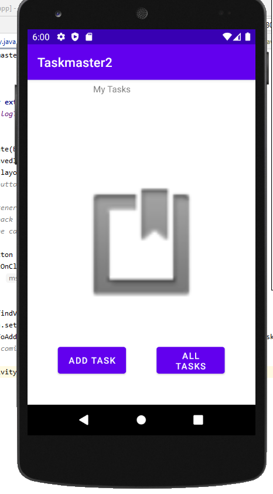
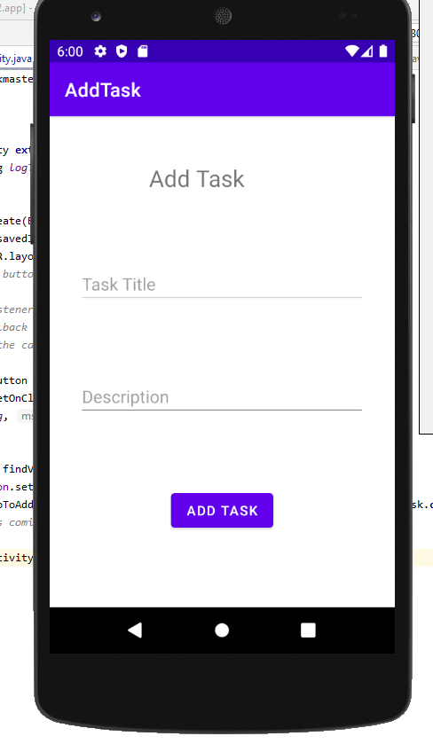
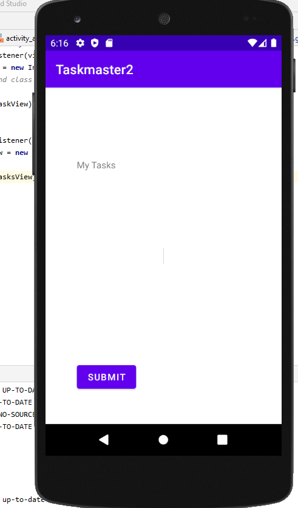
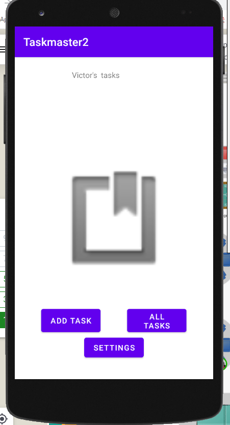
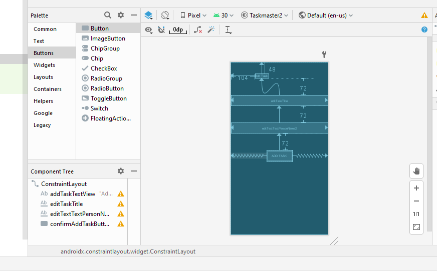
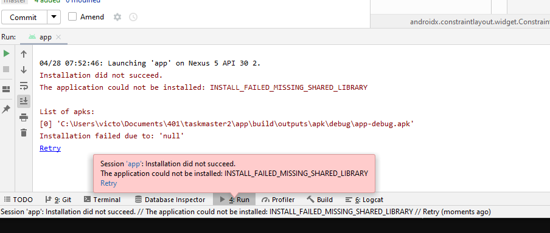

<<<<<<< HEAD
# Task Master Day 1 
# 26 April 2021
## Add Home Page, "Add a Task" page, and "My Tasks" page

=======
# Task Master Day 1 
# 26 April 2021
## Add Home Page, "Add a Task" page, and "My Tasks" page

#Task Master Day 2
# 27 April 2021
## Task Detail Page
Create a Task Detail page. It should have a title at the top of the page, and a Lorem Ipsum description.

## Settings Page
Create a Settings page. It should allow users to enter their username and hit save.

## Homepage
The main page should be modified to contain three different buttons with hardcoded task titles. When a user taps one of the titles, it should go to the Task Detail page, and the title at the top of the page should match the task title that was tapped on the previous page.

The homepage should also contain a button to visit the Settings page, and once the user has entered their username, it should display “{username}’s tasks” above the three task buttons.

# 5 May 2021
## Daily Notes
### Updated with pushed user name.

//////////////////////////////////////////////////

//////////////////////////////////////////////////

>>>>>>> d039e93790296bb8f2621fe184fddfe4f729ab63
